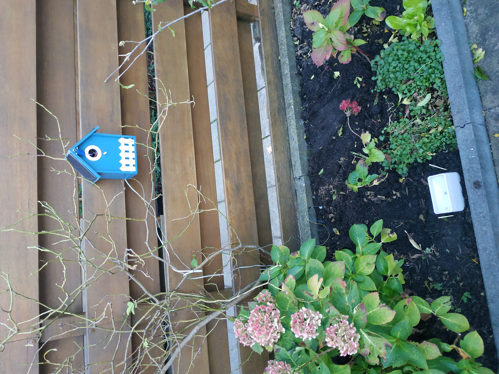
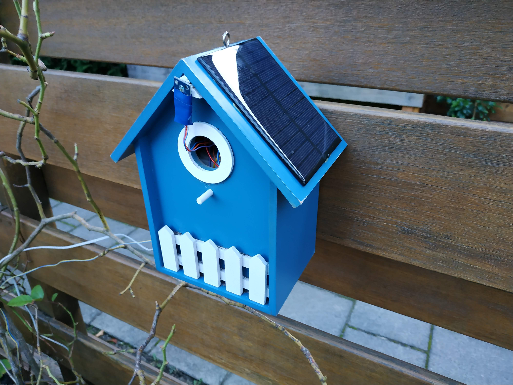
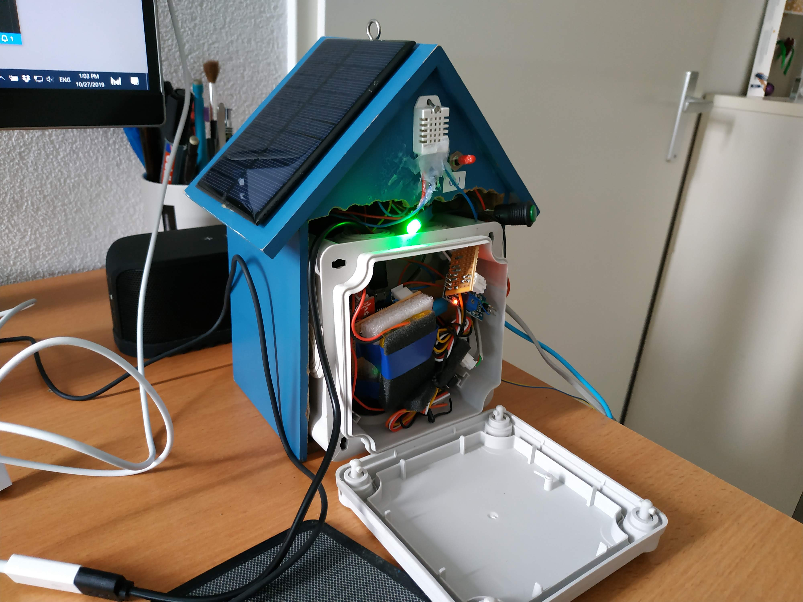
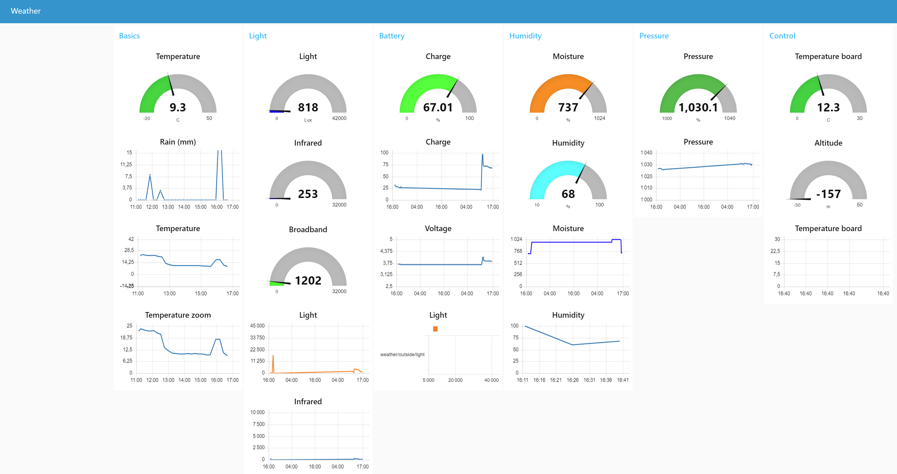

# Autonomous outside weather station

Build a complete autonomous outside weather station that can stay for years without battery change in your garden.
The station communicate the weather data to your home server OR a web server.
You can at any time access the graphs and last sensors values, from a web interface (smartphone compatible).

Total estimated cost of the full station: 40 euros.




# Elements

Here is the detailed list of logical elements that compose the station.

## Station 

The station is build to be outside.
For that I use a small bird house.

Estimated cost: 5 euros



## Main card with Wifi communication

The main card consist only of a ESP8266 + multiple connexions to each modules.
And for easy on/off, I have put a switch and a LED between the power module and the ESP8266.

Estimated cost: 3 euros

### Special Wire for DeepSleep

I use the deep sleep feature to save more power, and only take values every 10 minutes.

For that : Connect D0 to RST and use the deepSleep method in the code.

### Wifi Manager

You can install it from the library manager in arduino IDE
- [Wifi Manager] (https://github.com/tzapu/WiFiManager)

### MQTT

You can install it from the library manager in arduino IDE
- [PubSubClient] (https://github.com/knolleary/pubsubclient)

## Power module (Solar powered battery with level via I2C)

This module provide 4 outputs, 2 for power (+3.7V/GND) and 2 for battery level (I2C).
The battery is continuously charged by solar panel, with surcharge protection.
This module is autonomous and can be reuse in some other ESP8266 project.

[Detailed infos (Build instructions, components, sample code)](./elements/power_module/README.md)

## Rain counter module (Autonomous + low power consumption)  

This module provide a 5 pin interface: 2 for power (+3.7V/GND), 1 for waking up the module, 2 for communication (I2C)
This module should count the number of millimeter of rain. (precision 0.5 mm)
With a low power and complete autonomy even if main card is in sleep mode.

[Detailed infos (Build instructions, components, sample code)](./elements/rain_counter_module/README.md)

## Temperature and humidity sensor

This module you can read the outside temperature and humidity.
This module provide a 3 pin interface: 2 for power (3.7V/GND), 1 for reading the data.

[Detailed infos (Build instructions, components, sample code)](./elements/temperature_humidity_sensor/README.md)

## Atmospheric Pressure (+ station inside temperature and altitude)

This module provide atmospheric pressure, the temperature and the altitude.
This module is soldered directly on the main card with the ESP8266. (not autonomous, cannot be replace)

[Detailed infos (Build instructions, components, sample code)](./elements/barometric_sensor/README.md)

## Moisture sensor (or Hygrometer)

This module you can read the humidity of the soil with a probe.
This module provide a 4 pin interface (2 for power (3.7V/GND), 1 for waking up the module, 1 for com/reading)

[Detailed infos (Build instructions, components, sample code)](./elements/moisture_sensor/README.md)

## Light level sensor (Sun sensor)

This module you can read the level of the sun light (in lux)
This module provide a 4 pin interface: 2 for power (3.7V/GND), 2 for communication (I2C)

[Detailed infos (Build instructions, components, sample code)](./elements/light_level_sensor/README.md)

## Web Interface (Running on a home server)

I use Node-Red with the plugin for web UI.



## Install MQTT Broker on rapsberry Pi

See https://www.instructables.com/id/How-to-Use-MQTT-With-the-Raspberry-Pi-and-ESP8266/

```
sudo apt-get update
sudo apt-get upgrade
sudo apt-get install mosquitto -y
sudo apt-get install mosquitto-clients -y
```
## Final programs

See [Final program](./src/main.ino)
