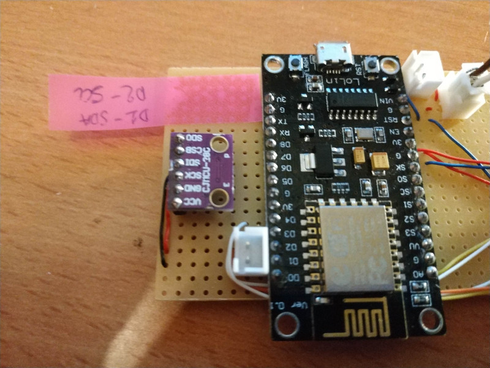
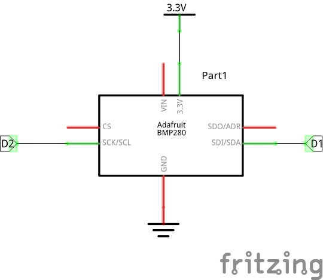

# Module : Atmospheric Pressure (+Temperature and altitude sensor)

With this module you can know the atmospheric pressure, the temperature and the altitude.

We use a BMP280 sensor connected on I2C.
Because we have another module for temperature with a better precision, we are going to put this one inside the weather station.
So the temperature will be the "inside" temperature around the ESP core.

## Good guide

See a good guide from adafruit here : https://learn.adafruit.com/adafruit-bmp280-barometric-pressure-plus-temperature-sensor-breakout/overview

## Warning : if you use a clone of the "adafruit" BMP280 sensor

If like me, you use a clone (chinese) version of the BMP280 sensor, you may have a different I2C address for the component.
Normally the adafruit BMP280 use the address "0x77" as you can see here in the lib : https://github.com/adafruit/Adafruit_BMP280_Library/blob/master/Adafruit_BMP280.h#L37
In my case the address is : 0x76

To find your address, use an I2C scanner on the ESP8266 : [tools/i2c_scanner](../../tools/i2c_scanner)
After this operation, I simply change the address use by the library by doing this : 

```c
#define BMP280_I2C_ADDRESS 0x76

// ....

void initBarrometricSensor() {
  if (!bmp.begin(BMP280_I2C_ADDRESS)) {  
    Serial.println("Could not find a valid BMP280 sensor, check wiring!");
  }
}

```

## Images

### Module directly wired to the ESP8266



## Components 

- 1 BMP280 (0.85 euro)

## Schema



## Required libraries 

- Search in arduino IDE the library "Adafruit Unified Sensor" And "Adafruit BMP280 Library" and install them.

## Tests 

Use the code [Basic reading BMP280](./basic_reading_bmp280_from_esp8266/basic_reading_bmp280_from_esp8266.ino) to test the module.
This code will just continuously ask the module the value of pressure, temperature and altitude.
