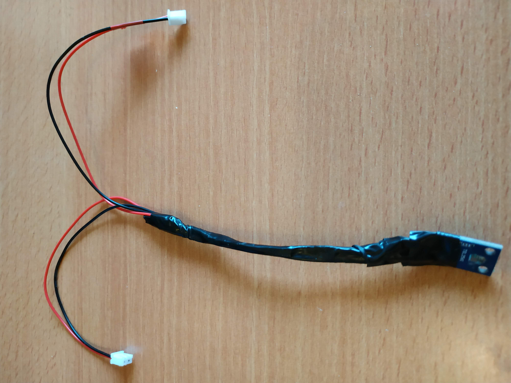
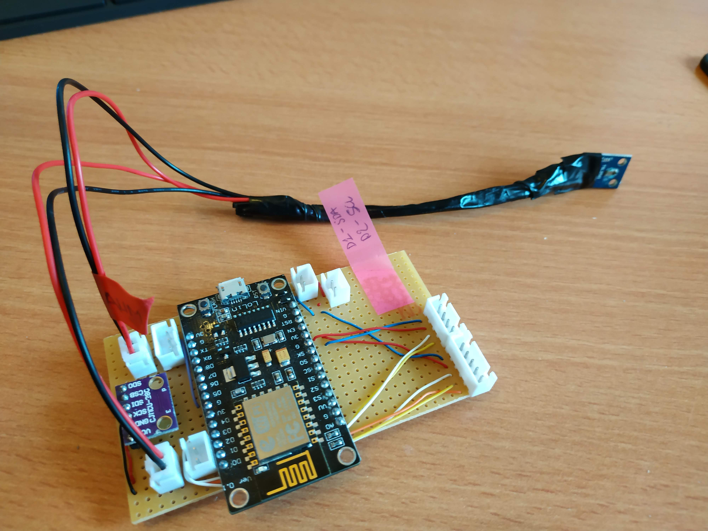
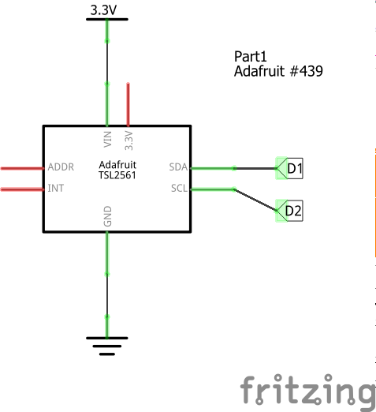

# Module : Light level sensor

With this module you can know the level of light. 
Usefull if you couple this data with the level of the power module, you can see normally when the solar panel are the most efficient.
For that we use a TSL2561 sensor.

## Images

### Module alone

### Module connected to all elements

## Output

- 1 * 2 Pin ( (Vin 3.3v / GND)
- 1 * 2 Pin ( (SDA / SCL)

## Components

- 1 sensor TSL2561

Estimated cost around 2 euro

## Schema

## Required libraries 

You can install it from the library manager in arduino IDE
- [Adafruit Unified Sensor] (https://github.com/adafruit/Adafruit_Sensor)
- [Adafruit TSL2561 (by Adafruit)](https://github.com/adafruit/Adafruit_TSL2561)

## Tests 

Use the code [Reading light level](./read_light-level_sensor.ino) to test the module.
This code will just continuously ask the module the value of the light level.
