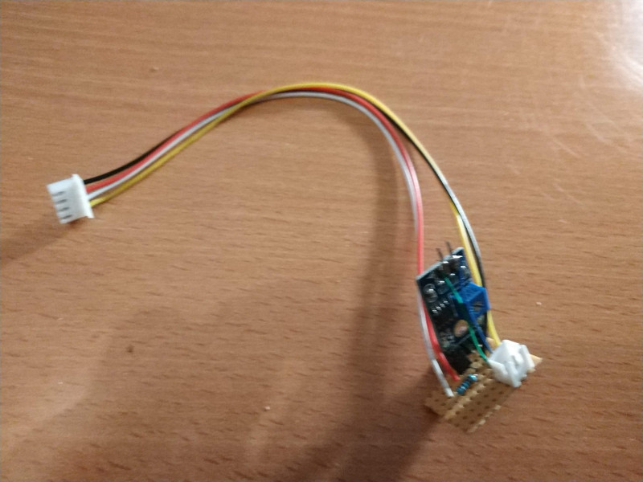
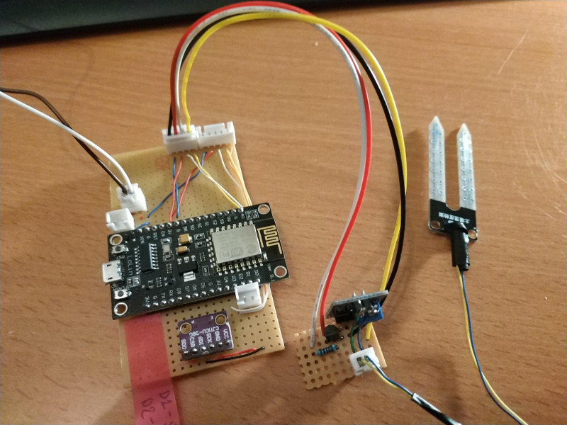
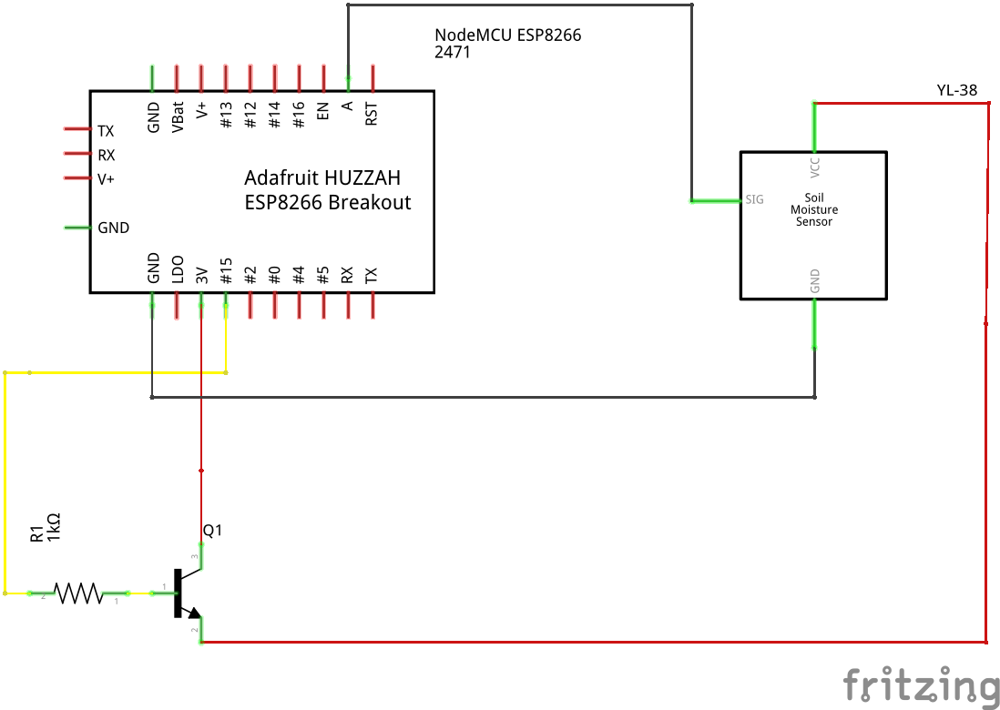

# Module : Soil Moisture Sensor

With this module you can read the humidity of the soil. 
For that we use a couple YL-38/YL-69.

## Corrosion / oxidation issue solution

If you use a soil moisture sensor before, if the sensor is powered for a long time, the probe is going to be oxided. 

So to avoid corrosion / oxidation we will power up the sensor only when reading, using a NPN Transistor (BC547) as switch.

## Images

### Module alone



### Module connected to all elements



## Input

- 1 * 2 Pin for soil probe (YL-69)

## Output
- 1 * 4 Pin ( (Vin / GND / Reading Pin / Power On)

## Components 

- 1 hygrometer detection YL-69/YL-38 + (1euro)
- 1 transistor NPN BC547C (0.5 euro)
- 1 1 KOhm resistor ( 0.1 euro )

- some bakelite plate and thin wires (1 euro)

Estimated cost around 2.60 euros

## Schema



## Required libraries 

[YL-38/YL-69 Sensor Arduino lib](https://github.com/jonson/arduino-moisture-sensor)

Execute [install.sh](./scripts/install.sh)

Or : 

```bash
git clone git@github.com:jonson/arduino-moisture-sensor.git
mv arduino-moisture-senso/libraries/ ~/Arduino/libraries
```

## Tests 

Use the code [Reading moisture](./read_moisture_sensor/read_moisture_sensor.ino) to test the module.
This code will just continuously ask the module the value of humidity of the soil.


### Issues

Don't use PIN D4 (GPIO 2) for the reading Pin.
There is an issue with this Pin if your ESP8266 goes to deepsleep, it remains the pin High ...
I use the GPIO 12 (D6) with no issue in deep sleep (The state remains low)
