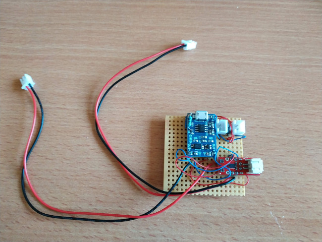
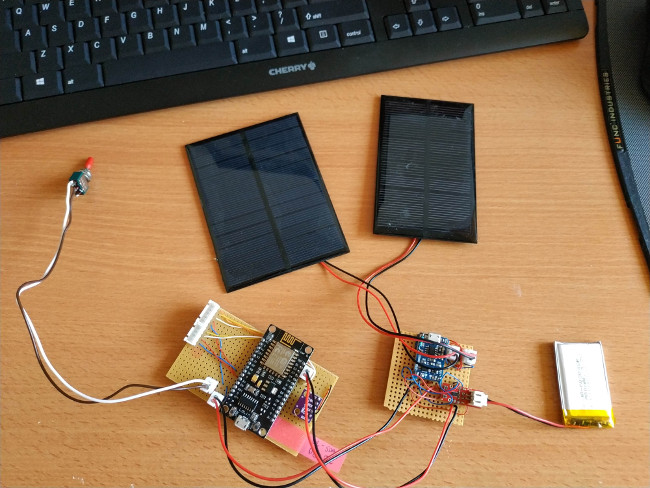
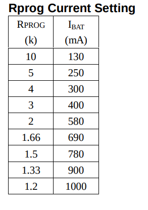
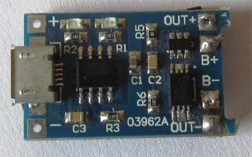
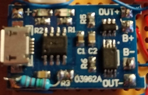
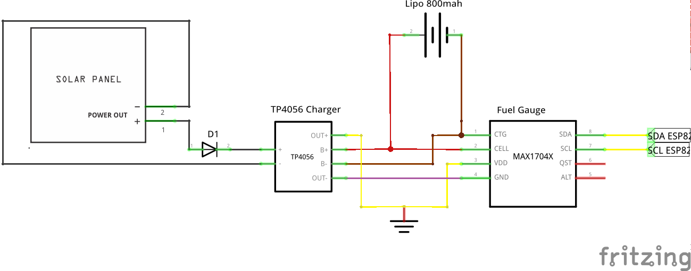

# Module : Power system

This module should power our station (3.7V) and give some information about the battery level.
To charge the battery, we can plug a USB cable or put one or two solar panels. 
The idea is to use only solar panel all the time to continuously charge the battery. (full autonomy)

We also put a switch button between the ESP8266 and the power module, so we can easily restart our station.

## Images

### Module alone



### Module connected to all elements



## Input

- 2 * 2 Pin for solar panels
- 1 micro usb for charging only
- 1 * 2 mini pin for a Lipo Battery

## Output
- 1 * 2 Pin 3.7V Power (Vin + GND)
- 1 * 2 Pin I2C battery level

## Components 

- 2 solar panels 5V 1.25W 250mA 110x70mm (4 euros)
- 1 switch button (0.5 euro)
- 1 TP4056 Charger module (with dual protection very important) [modified] (0.28 euro)
- 1 1.5 KOhm resistor ( 0.1 euro )
- 1 battery fuel gauge module MAX17043 (2.3 euros)
- 1 Diode 1N4007 (0.1 euro)
- 1 battery Lipo 800mah (2.5 euros)

- some bakelite plate and thin wires (1 euro)

Estimated cost around 10.78 euros

## Adapt TP4056 to our battery

We need to replace the command resistor of TP4056, because the default resistor is for a 1000mah battery.
Follow the [datasheet](https://dlnmh9ip6v2uc.cloudfront.net/datasheets/Prototyping/TP4056.pdf), to know the new resistor value for a 800mah battery:



So we need to remove "R3" resistor



And put a new one like this : (you can put one side directly to GND)



## Schema



## Required libraries 

[MAX17043 Library](https://github.com/lucadentella/ArduinoLib_MAX17043)

Execute [install.sh](./scripts/install.sh)

Or : 

```bash
cd ~/Arduino/libraries
git clone git@github.com:lucadentella/ArduinoLib_MAX17043.git
```

## Tests 

Use the code [Reading battery level](./reading_battery_level/reading_battery_level.ino) to test the module.
This code will just continuously ask the battery level and voltage to the module.
