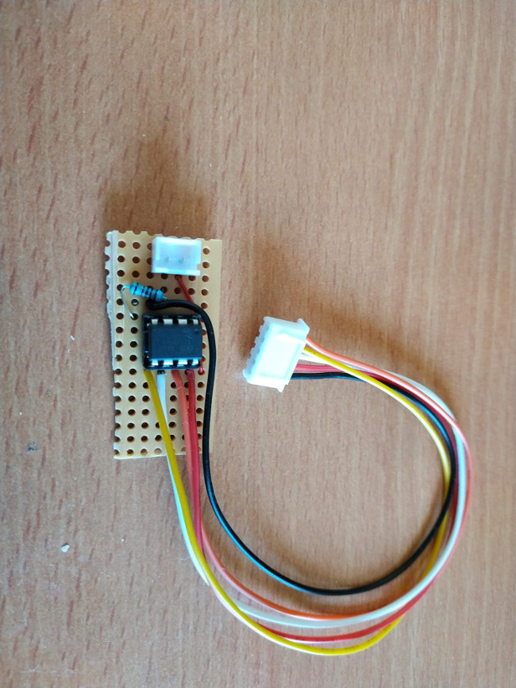
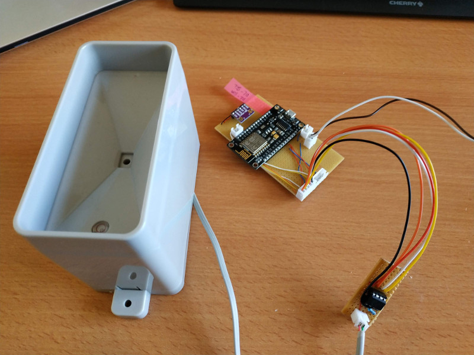
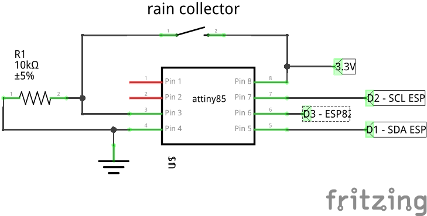
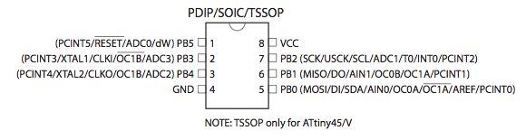
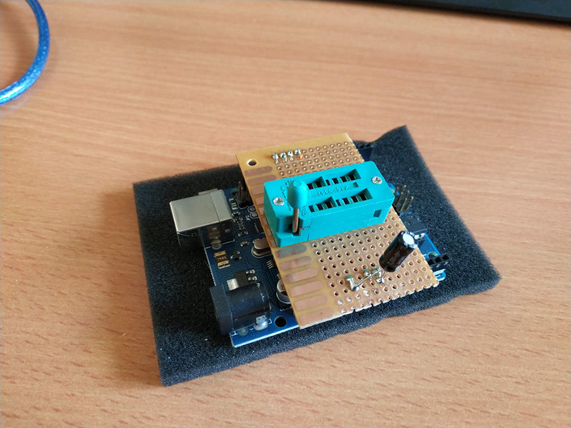

# Module : Rain counter

This module should count the number of millimeter of rain. 
With a low power and complete autonomy even if main card is in sleep mode.

## Images

### Module alone



### Module connected to all elements



## Input

- 1 * 2 pin from rain collector

## Output

- 1 * 5 pin (Vin 3V, GND, 1 Wake up pin, 1 SDA, 1 SCL)

## Components 

- 1 rain collector (see [Rain meter/ rain gauge/ weather station spare part](https://www.aliexpress.com/item/1-pcs-of-spare-part-for-weather-station-for-rain-meter-to-measure-the-rain-volume/32793367115.html) - around 10 euros)
- 1 resistor (0.1 euros)
- 1 ATTiny85 (1 euro)

- some bakelite plate and thin wires (1 euro)

Estimated cost around 12.10 euros

## Using a pre-built rain collector

For that we use a pre-built rain collector from a commercial weather station.
This module is simply a rain collector that emit close a circuit, for each half millimeter collected. 
Its exactly the same behavior if you press a push button for every millimeter of rain.

Note: my rain collector has a surface of 0.0055 m2.
1mm of rain = 1Liter/m2 so here to have 1mm, you need 5.5ml.

During my test, I discover that my rain collector close the circuit twice for each millimeter, so the precision is of 0.5mm.

## Use a ATTiny as an autonomous module to count signal from rain collector

Because our station is going to sleep most of the time, we doesn't want to listen this signal from the ESP8266.

Instead we use a ATTiny85 as a "counter".
This tiny ship will listen this signal and increment a counter in its own memory.
Regulary the ESP8266 will ask the ATTiny the current value, and in the same time reset the value.

## Save more power => Put ATTiny85 in sleep mode and use an interuption

To save more power, we also use the "interupt" feature of the ATTiny85.
So when a signal is receive, the ATTiny count from the interuption function even in sleep mode (low power).
When the ESP8266 want to ask via I2C the rain count, before it put to high a wake up pin on the ATTiny and after send the I2C request.

## Schema



See also the pinout of the ATTiny85



## Required libraries 

Execute [install.sh](./scripts/install.sh) 

Or install them manually in your Arduino Lib directory.

### ATTiny85 support for Arduino

In board manager of Arduino find "ATTiny" lin and install it.

Required additional url in package manager : https://raw.githubusercontent.com/damellis/attiny/ide-1.6.x-boards-manager/package_damellis_attiny_index.json
More instructions [here](https://www.hackster.io/arjun/programming-attiny85-with-arduino-uno-afb829) .

### TinyWireS: AtTiny85 I2C Library

This [lib](https://github.com/nadavmatalon/TinyWireS) is used to make the ATTiny85 a slave on I2C.

Don't use the last version, there is an issue.
Use the one [here](./libs/TinyWireS).

## How to program the ATTiny85 ? 

See this good tutorial on [Hacktser](https://www.hackster.io/arjun/programming-attiny85-with-arduino-uno-afb829) 
I did exactly the same, I recommend to build a shield for programming the ATTiny85 with a "ZIF Socket".



## Tests and development

For doing this module, I did a lot of small steps to test how to use the ATTiny85.
You can see all this step in order in the [./src](./src) folder.

### 1 - Try just to program the ATTiny85 with Arduino UNO + homemade shield

A simple program to blink the a LED.

### 2 - Do a communication with I2C between Arduino UNO and ATTiny85

Increase internal variable and return its value on each Arduino I2C request.

### 3 - Listen Interupt pin to count on ATTiny

### 4 - Interupt count + I2C communication 

### 5 - Interupt count + sleep + I2C Communication (Final ATTiny program)

### 6 - Final example using ESP8266 instead of Arduino Uno

## Issue with rain count not corresponding to number of closing on the rain collector

There is a difference between the number of tap of the rain collector, and what give the ATTiny85.
After several measure, I have decide to apply this formula to get the closest right value:

```c
ceil(value /10)
```

Of course it's an hack, I suppose the signal when the collector close the circuit create some "Jumps".
A way to fix it will be to clear the signal, maybe with a capacitor?
