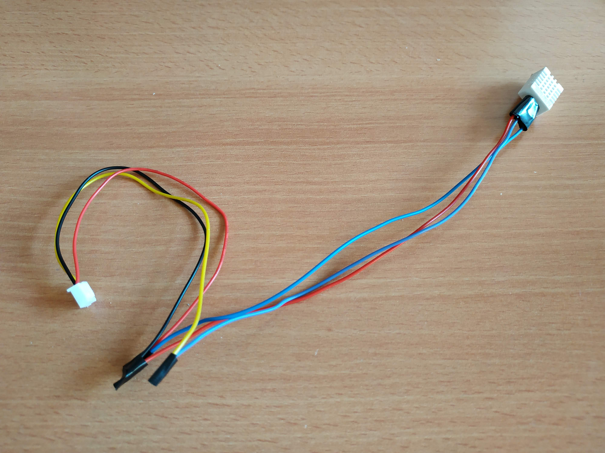

# Module : Temperature and humidity sensor

With this module you can read the temperature and humidity of the external air.
For that we use a DHT22 sensor.

## Images

### Module alone

### Module connected to all elements

## Output

- 1 * 3 Pin ( (Vin / GND / Reading Pin )

## Components

- 1 sensor DHT22

Estimated cost around 2.50 euros

## Schema

## Required libraries 

You can install it from the library manager in arduino IDE
- [Adafruit Unified Sensor] (https://github.com/adafruit/Adafruit_Sensor)
- [DHT sensor library (by Adafruit)](https://github.com/adafruit/DHT-sensor-library)

## Tests 

Use the code [Reading temperature and humidity](./read_temperature_humidity_sensor.ino) to test the module.
This code will just continuously ask the module the value of temperature and humidity.
